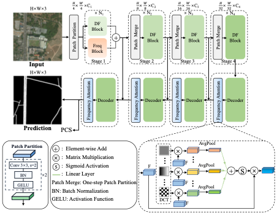

# FDMamba: Frequency-Enhanced Deformable Mamba for Topology-Aware Road Extraction

This document provides the project-specific instructions for **FDMamba**, corresponding to the manuscript:

> **FDMamba: Frequency-Enhanced Deformable Mamba for Topology-Aware Road Extraction**

FDMamba is implemented in the shared `segsRoad` repository, which is a MMSegmentation-based codebase for remote sensing road extraction. This file is intended to clearly distinguish FDMamba from other projects maintained in the same repository, such as SegRoadv3.



---

## 1. Relationship to the Shared Repository

`segsRoad` is a shared research codebase used for multiple road extraction projects. It is not a single-project repository.

- **FDMamba** is the method proposed in the manuscript *FDMamba: Frequency-Enhanced Deformable Mamba for Topology-Aware Road Extraction*.
- **SegRoadv3** is a separate project maintained in the same repository.
- The two projects may share common infrastructure, dataset preparation scripts, training utilities, and MMSegmentation components, but they correspond to different manuscripts and different model designs.

The FDMamba implementation is organized around the following configuration files:

```text
configs/fdmamba/deep_dualmamba_mfa_pcs_base_80k.py
configs/fdmamba/chn6_dualmamba_mfa_pcs_base_80k.py
```

The internal name `dualmamba_mfa_pcs` refers to the FDMamba implementation:

- `dualmamba`: the dual-domain Mamba design combining Frequency Mamba and Deformable Mamba.
- `mfa`: the Frequency Attention module used in the decoder.
- `pcs`: the Pixel Connectivity Structure auxiliary supervision used to improve road connectivity.

---

## 2. Method Overview

FDMamba is a frequency-spatial collaborative framework for topology-aware road extraction from high-resolution remote sensing imagery. It contains three core components:

1. **Frequency Mamba (FreqMamba)**  
   FreqMamba transforms early-stage spatial features into the frequency domain and applies spiral selective scanning on the centered frequency spectrum. This enables low-frequency-to-high-frequency modeling, helping the network capture global road-layout priors before local details.

2. **Deformable Mamba (DMamba)**  
   DMamba performs adaptive spatial-domain scanning. It learns input-dependent offsets and constructs deformable scanning paths, allowing the model to better follow curved roads, occluded road segments, and complex intersections.

3. **Frequency Attention (FA)**  
   FA is a DCT-based frequency attention module inserted into the decoder. It samples representative frequency components to generate channel-wise attention weights and refines multi-scale decoder features.

In addition, FDMamba uses the Pixel Connectivity Structure (PCS) loss as auxiliary supervision to enhance the continuity of road predictions.

---

## 3. Main Configurations

| Dataset | Config file | Task | Training schedule |
|---|---|---|---|
| DeepGlobe | `configs/fdmamba/deep_dualmamba_mfa_pcs_base_80k.py` | Binary road segmentation | 80k iterations |
| CHN6-CUG | `configs/fdmamba/chn6_dualmamba_mfa_pcs_base_80k.py` | Binary road segmentation | 80k iterations |

Before training or testing, please check the `data_root`, image directory, annotation directory, class names, and palette settings in each config file.

---

## 4. Installation

This repository is based on MMSegmentation. Please install the basic MMSegmentation dependencies first, then compile the custom Mamba-related CUDA operators if required by your environment.

### 4.1 Create environment

```bash
conda create -n fdmamba python=3.9 -y
conda activate fdmamba
```

### 4.2 Install PyTorch

Install PyTorch according to your CUDA version. For example:

```bash
pip install torch torchvision torchaudio --index-url https://download.pytorch.org/whl/cu118
```

### 4.3 Install MMSegmentation dependencies

```bash
pip install -U openmim
mim install mmengine
mim install mmcv
pip install -r requirements.txt
pip install -v -e .
```

### 4.4 Compile custom operators

If the Mamba or deformable scan operators are used in your configuration, compile the corresponding custom operators:

```bash
cd mmseg/models/backbones/mamba/damamba/ops_dcnv3
pip install -e .

cd ../selective_scan
pip install -e .
```

If your local repository structure differs, please adjust the paths accordingly.

---

## 5. Dataset Preparation

The experiments in the FDMamba manuscript use two pixel-level road extraction datasets:

- DeepGlobe Road Dataset
- CHN6-CUG Road Dataset

A typical MMSegmentation-style directory structure is shown below. You may also use your own structure if the paths are correctly specified in the config files.

```text
data/
├── DeepGlobe/
│   ├── img_dir/
│   │   ├── train/
│   │   └── val/
│   └── ann_dir/
│       ├── train/
│       └── val/
└── CHN6-CUG/
    ├── img_dir/
    │   ├── train/
    │   └── val/
    └── ann_dir/
        ├── train/
        └── val/
```

Please ensure that the segmentation labels follow the expected binary road-extraction format:

- `0`: background
- `1`: road

If your original labels use different pixel values, convert them before training or modify the dataset pipeline accordingly.

---

## 6. Training

### 6.1 Train on DeepGlobe

```bash
python tools/train.py configs/fdmamba/deep_dualmamba_mfa_pcs_base_80k.py --amp
```

### 6.2 Train on CHN6-CUG

```bash
python tools/train.py configs/fdmamba/chn6_dualmamba_mfa_pcs_base_80k.py --amp
```

### 6.3 Multi-GPU training

For multi-GPU training, use the distributed training script provided by MMSegmentation:

```bash
bash tools/dist_train.sh configs/fdmamba/deep_dualmamba_mfa_pcs_base_80k.py 2 --amp
bash tools/dist_train.sh configs/fdmamba/chn6_dualmamba_mfa_pcs_base_80k.py 2 --amp
```

Change `2` to the number of GPUs used in your environment.

---

## 7. Evaluation

### 7.1 Evaluate on DeepGlobe

```bash
python tools/test.py configs/fdmamba/deep_dualmamba_mfa_pcs_base_80k.py /path/to/fdmamba_deepglobe_checkpoint.pth
```

### 7.2 Evaluate on CHN6-CUG

```bash
python tools/test.py configs/fdmamba/chn6_dualmamba_mfa_pcs_base_80k.py /path/to/fdmamba_chn6_checkpoint.pth
```

If you want to save prediction maps, add the corresponding MMSegmentation output options according to your local version, for example:

```bash
python tools/test.py configs/fdmamba/deep_dualmamba_mfa_pcs_base_80k.py /path/to/checkpoint.pth --show-dir /path/to/save_predictions
```

---

## 8. Inference

Run inference on a single image or an image directory:

```bash
python demo/image_demo_with_inferencer.py /path/to/image_or_dir configs/fdmamba/deep_dualmamba_mfa_pcs_base_80k.py --checkpoint /path/to/fdmamba_deepglobe_checkpoint.pth --output-dir /path/to/output_dir
```

For CHN6-CUG, replace the config and checkpoint accordingly:

```bash
python demo/image_demo_with_inferencer.py /path/to/image_or_dir configs/fdmamba/chn6_dualmamba_mfa_pcs_base_80k.py --checkpoint /path/to/fdmamba_chn6_checkpoint.pth --output-dir /path/to/output_dir
```

---

## 9. Reported Results

The following results correspond to the FDMamba manuscript settings.

| Dataset | IoUroad (%) | MIoU (%) | F1 (%) | Precision (%) | Recall (%) |
|---|---:|---:|---:|---:|---:|
| DeepGlobe | 71.83 | 85.20 | 83.61 | 84.88 | 82.37 |
| CHN6-CUG | 66.60 | 82.11 | 79.95 | 81.28 | 78.67 |

Small numerical differences may occur due to hardware, CUDA version, random seed, data preprocessing, or checkpoint selection.

---

## 10. Notes on Reproducibility

To reproduce the manuscript results as closely as possible, please check the following settings:

- Input crop size: `512 x 512`
- Training schedule: `80k` iterations
- Optimizer and learning-rate schedule: defined in each config file
- Dataset split: consistent with the manuscript
- Evaluation metrics: IoUroad, MIoU, F1, Precision, and Recall
- PCS loss: enabled in the FDMamba configs
- FA module: enabled in the decoder

If you modify the dataset split, crop size, augmentation strategy, or training schedule, the final metrics may change.

---

## 11. Project Structure

Recommended FDMamba-related files are organized as follows:

```text
configs/
└── fdmamba/
    ├── deep_dualmamba_mfa_pcs_base_80k.py
    └── chn6_dualmamba_mfa_pcs_base_80k.py

mmseg/
└── models/
    ├── backbones/
    │   └── ... FDMamba / DualMamba / Mamba-related modules ...
    ├── decode_heads/
    │   └── ... FA / PCS-related modules if implemented here ...
    └── losses/
        └── ... PCS loss if implemented here ...

docs/
└── FDMamba.md
```

The exact source-code locations may vary depending on how the shared repository is organized, but the FDMamba-specific configs should always be placed under `configs/fdmamba/`.

---

## 12. Citation

If you use this implementation, please cite the FDMamba manuscript. The BibTeX entry will be updated after publication.

```bibtex
@article{yu2026fdmamba,
  title={FDMamba: Frequency-Enhanced Deformable Mamba for Topology-Aware Road Extraction},
  author={Yu, Zhengbo and Li, Binbin and Zhong, Dongsheng and Chen, Zhe and Yang, Weirong and Sun, Zhongchang and Xiao, Keyan and Li, Cheng and Picco, Lorenzo},
  journal={Under review},
  year={2026}
}
```

---

## 13. Acknowledgements

This project is developed based on the MMSegmentation framework and benefits from related Mamba and visual state-space model implementations. We thank the authors of these open-source projects and the creators of the DeepGlobe and CHN6-CUG datasets.

---

## 14. License

This repository follows the license provided in the root `LICENSE` file. Please also check the licenses of MMSegmentation and any third-party dependencies used by this project.