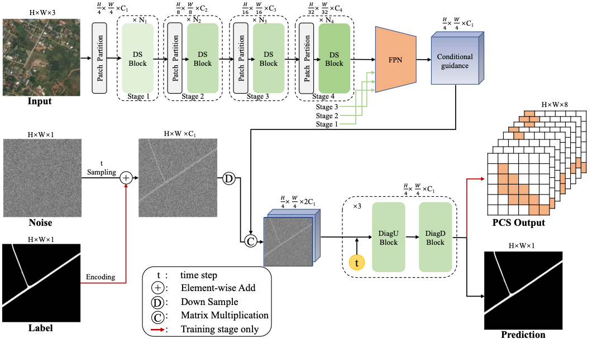

# Mamba Meets Diffusion: SegRoadv3 for Fine-Grained Road Extraction in Remote Sensing Imagery

Zhengbo Yu, Zhe Chen, binbin Li, RuiTing Hu, Xingyu Bai, Qiaoran He, Li Sun, Zhongchang Sun, i, Keyan Xiao, Huadong Guo
<td align="center">Under Review</td>


## Abstract
This paper proposes SegRoadv3, a novel road extraction model that integrates state space modeling with diffusion-based generation for remote sensing imagery. Unlike conventional methods that rely on direct pixel-wise classification, SegRoadv3 formulates road extraction as a progressive denoising process, reconstructing complete and coherent road structures from randomly perturbed inputs. The model employs a Deformable State Space backbone (DSMamba) to effectively capture global dependencies and directional continuity in road patterns. In the decoding phase, we introduce a Diagonal Mamba (DiagMamba) module to enhance fine-grained structural representations through multi-step denoising. Additionally, a Pixel Connectivity Structure (PCS) is incorporated as an auxiliary supervision strategy to explicitly improve connectivity in occluded or fragmented regions. Extensive experiments demonstrate that SegRoadv3 achieves new state-of-the-art (SOTA) performance, reaching an IoU of 71.06% on the DeepGlobe dataset and 66.57% on the CHN6-CUG dataset. Moreover, SegRoadv3 significantly enhances the completeness and continuity of road extraction results. To the best of our knowledge, this is the first attempt to integrate Mamba and diffusion mechanisms for road extraction, providing a new paradigm for structure-aware and generative segmentation in remote sensing applications. The corresponding code is publicly available at https://github.com/Yu-zhengbo/segsRoad.


## Installation

See [MMSegmentation installation instructions](./README_zh-CN.md) and <a href='https://github.com/MzeroMiko/VMamba'>VMmamba installation instructions</a>

Then 
````python
cd mmseg/models/backbones/mamba/damamba/ops_dcnv3

pip install -e .

cd mmseg/models/backbones/mamba/damamba/selective_scan

pip install -e .
````


## Getting Started


### Training & Evaluation in Command Line

#### Training
````python
# Single-GPU training (recommended)
python tools/train.py configs/segroad/deep_segroadv3.py --amp
````


#### Evaluation
````python
python tools/test.py configs/segroad/deep_segroadv3.py /path/to/checkpoint_file
````

#### Inference with a trained model
````python
python demo/image_demo_with_inferencer.py /path/to/image_or_dir/ configs/segroad/deep_segroadv3.py --checkpoint /path/to/checkpoint_file --output-dir /path/to/output_dir
````


## </a>Citing SegRoadv3

As the paper is under review, we will update the citation information when the paper is accepted.
```
Mamba Meets Diffusion: SegRoadv3 for Fine-Grained Road Extraction in Remote Sensing Imagery
```

## Reference

This project is developed with reference to MMSegmentation, and VMamba. We would like to express our gratitude to the authors of MMSegmentation, DSMamba and VMamba for their contributions, which served as a valuable foundation and inspiration for our work. If you find this project helpful, please also consider citing or exploring the original repositories.
