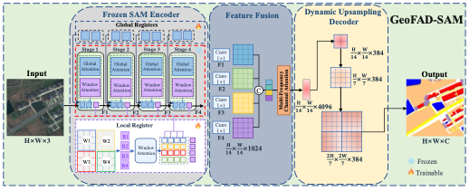

# GeoFAD-SAM

This document records the project-specific entry points for the manuscript:

> **GeoFAD-SAM: Same-Scale Feature Adaptation of Segment Anything Models with
> Register Guidance, Frequency Fusion, and Dynamic Reconstruction**

GeoFAD-SAM is developed in the shared `segsRoad` MMSegmentation codebase. The
top-level [README.md](../../README.md) describes the common framework; this file keeps
the GeoFAD-SAM-specific method map and reproduction commands.

## Method Overview

GeoFAD-SAM adapts SAM features for dense remote sensing semantic segmentation.
The implementation follows the architecture shown in the paper figure:

```text
Input image
  -> Frozen SAM encoder with register guidance
  -> Same-scale feature fusion
  -> Dynamic upsampling decoder
  -> Dense segmentation map
```

<p align="center">
  
</p>

<p align="center">
  <em>Overview of GeoFAD-SAM.</em>
</p>

## Module Map

| Paper component | Implementation | Role |
|---|---|---|
| Frozen SAM encoder | `SAM3Vit` in `mmseg/models/backbones/sam_backbone.py` | Extracts dense SAM ViT features for segmentation |
| Global register guidance | `SAM3Register` in `mmseg/models/backbones/sam_finetune.py` | Adds learnable global register tokens to SAM global attention blocks |
| Local register guidance | `SAM3WindowRegister` in `mmseg/models/backbones/sam_finetune.py` | Adds local register tokens inside window attention blocks |
| Same-scale feature fusion | `ConcatMFCADyPCADecoder` in `mmseg/models/decode_heads/pca_head.py` | Projects multi-stage SAM features to a common scale and fuses them |
| Frequency fusion | `MultiFrequencyChannelAttention` in `mmseg/models/decode_heads/mfa_pcs_uper_head.py` | Applies DCT-based multi-frequency channel attention |
| Dynamic reconstruction | `DySample` in `mmseg/models/utils/dysample.py` | Performs offset-guided dynamic upsampling during decoder reconstruction |

## Main Configs

| Dataset | Config | Backbone | Decoder | Schedule |
|---|---|---|---|---|
| LoveDA | `configs/lovedaSam/loveda_GeoFAD_20k.py` | `SAM3Vit` | `ConcatMFCADyPCADecoder` | 20k iterations |
| Vaihingen | `configs/Samvaihingen/vaihingen_GeoFAD_20k.py` | `SAM3WindowRegister` | `ConcatMFCADyPCADecoder` | 20k iterations |
| Potsdam | `configs/Sampostdam/potsdam_GeoFAD_20k.py` | `SAM3WindowRegister` | `ConcatMFCADyPCADecoder` | 20k iterations |
| CHN6-CUG | `configs/Samchn6/chn6_GeoFAD_20k.py` | `SAM3WindowRegister` | `ConcatMFCADyPCADecoder` | 20k iterations |

Dataset base configs:

```text
configs/_base_/datasets/loveda.py
configs/_base_/datasets/vaihingen_sam.py
configs/_base_/datasets/potsdam_sam.py
configs/_base_/datasets/chn6_sam.py
```

## SAM3 Dependency

The SAM3 source tree is not tracked by default:

```text
mmseg/models/backbones/sam3/
```

Before running GeoFAD-SAM configs, prepare the required SAM3 source code and
pretrained weights locally. Then check the checkpoint paths in:

```text
mmseg/models/backbones/sam_backbone.py
mmseg/models/backbones/sam_finetune.py
```

For a public release, replace local absolute paths with documented placeholder
paths such as `pretrained/sam3.pt`.

## Training

Single-GPU examples:

```bash
python tools/train.py configs/lovedaSam/loveda_GeoFAD_20k.py --amp
python tools/train.py configs/Samvaihingen/vaihingen_GeoFAD_20k.py --amp
python tools/train.py configs/Sampostdam/potsdam_GeoFAD_20k.py --amp
python tools/train.py configs/Samchn6/chn6_GeoFAD_20k.py --amp
```

Multi-GPU example:

```bash
bash tools/dist_train.sh configs/lovedaSam/loveda_GeoFAD_20k.py 2 --amp
```

## Evaluation

```bash
python tools/test.py configs/lovedaSam/loveda_GeoFAD_20k.py /path/to/checkpoint.pth
python tools/test.py configs/Samvaihingen/vaihingen_GeoFAD_20k.py /path/to/checkpoint.pth
python tools/test.py configs/Sampostdam/potsdam_GeoFAD_20k.py /path/to/checkpoint.pth
python tools/test.py configs/Samchn6/chn6_GeoFAD_20k.py /path/to/checkpoint.pth
```

## Notes for Submission Cleanup

- Keep this README focused on GeoFAD-SAM only.
- Keep FDMamba and SegRoadv3 details in their own README files.
- Do not commit SAM3 source dumps, pretrained checkpoints, `work_dirs/`, or
  notebook outputs.
- Before public release, add final paper results, checkpoint links, and the
  accepted citation when available.
